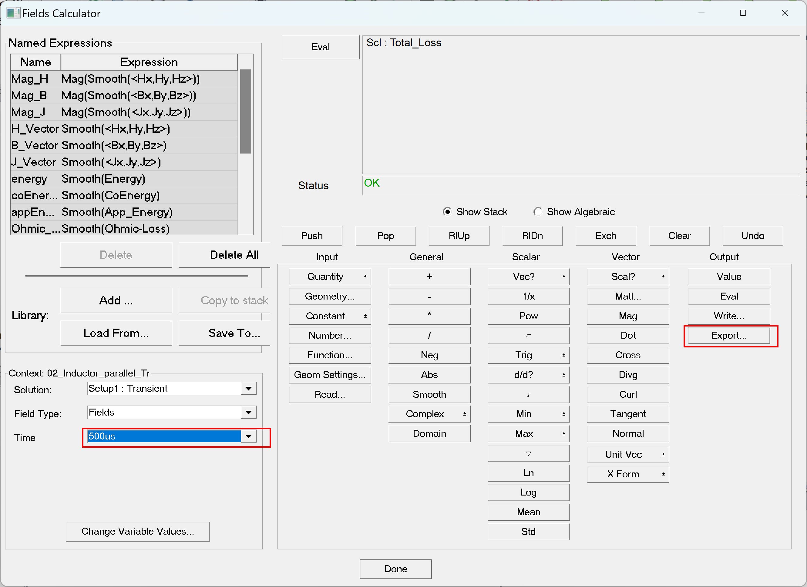
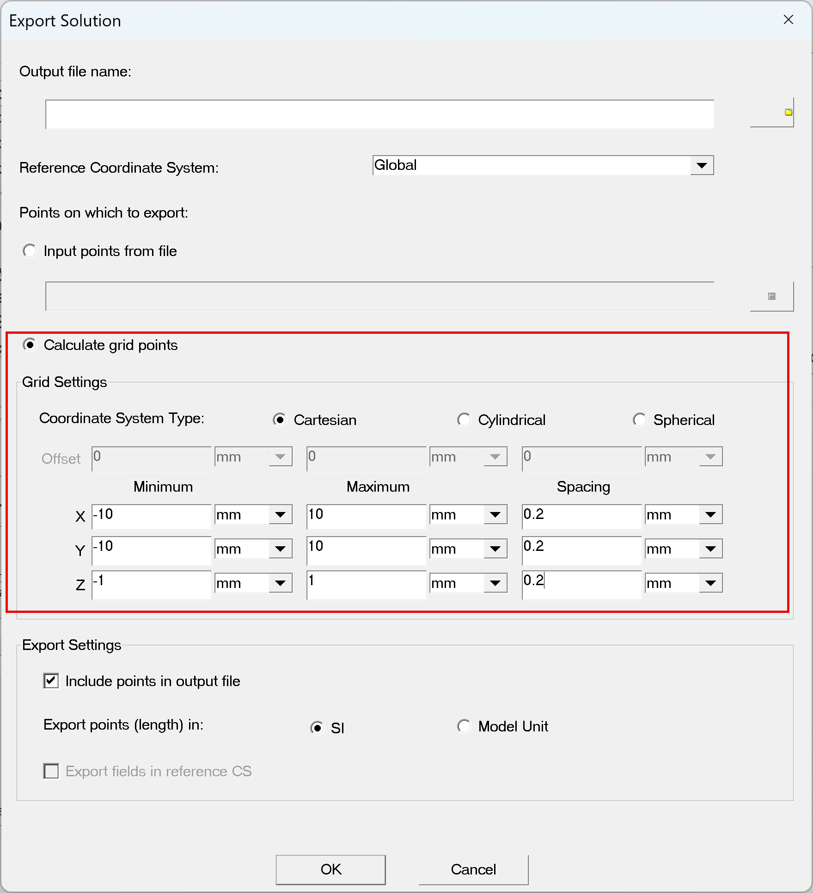

---
description: Maxwell 可以匯出場資訊給其他軟體做使用，例如 損耗場分布 (Total Loss Field)，作為 熱/結構耦合模擬的輸入 或 獨立數據分析。
---

# Export 場數據資訊

## 場資訊交換介紹

Maxwell 提供匯出模擬的場資訊給使用者作資料交換，場的格式是以\*.fld的檔案格式，`*.fld` 主要方便 **資料交換與分析。**

在 Maxwell 中最常被輸出的 `*.fld` 資料包括：

* **Joule loss density** (導體損耗分布)
* **Core loss density** (磁芯損耗分布)
* **磁通密度 B-field**
* **磁場強度 H-field**
* **電流密度 J-field**
* **電場分布 E-field**

這些分布可用於：

* 找出 **損耗熱點 (hotspot)** → 作為散熱設計依據
* 分析 **磁通集中區域** → 改善磁芯設計
* 提供 **外部耦合分析** → 熱–力–聲 模擬輸入

## 範例：Transient Solver匯出損耗資訊

下面以Transient Solver匯出損耗資訊為例作介紹，如果讀者是要使用其他求解器或是匯出其他的資訊(例如B場或J場），作法是相同的。


ANSYS軟體中的物理場耦合，ANSYS RD都已經為其量身訂做了制式的流程，建議使用軟體的串流模擬流程，加快模擬時間與減少模擬錯誤產生。


第一步是需要完成Maxwell的模擬，特別要注意的是要在Setup中把場資訊儲存做勾選。

再來是打開Field Calculator，點選Export。

<figure><figcaption>
圖1-5
</figcaption></figure>

* &#x20;輸入檔名，匯出 \*.fld的檔案資訊。
* 一次只能匯出一個時間點，且需要定義輸出的格點範圍及間距。請先在模型中量測物件的格點範圍及間距。
* 如果物件體積大的時候，檔案會很驚人，所以為避免檔案過大，建議可以輸出關注部分的範圍就好。

<figure><figcaption>
圖1-6
</figcaption></figure>

## `*.fld` 檔案&#x20;

最後輸出的`*.fld`檔案內容包含了X Y Z的座標軸與場資訊。以圖1-7為例：

* **Grid Output Min/Max**
  * 定義輸出網格的空間範圍：
    * Min: −20mm,−18mm,−6mm-20 mm, -18 mm, -6 mm−20mm,−18mm,−6mm
    * Max: 20mm,18mm,6mm20 mm, 18 mm, 6 mm20mm,18mm,6mm
  * 意即輸出場數據的 3D box 範圍。
* **Grid Size**
  * 每個維度的網格解析度：0.2mm,0.2mm,0.2mm0.2 mm, 0.2 mm, 0.2 mm0.2mm,0.2mm,0.2mm
  * 代表輸出資料是以均勻網格抽樣的。
* **欄位標頭 (Header)**
  * `X, Y, Z, Scalar data "Total_Loss"`
  * 前三欄是座標位置，最後一欄是對應點的「總損耗密度 (Total Loss)」。
* **數據行 (Data Rows)**
  * 每一行對應一個網格點：
  * X座標   Y座標   Z座標   場數據值

<figure><figcaption>
圖1-7
</figcaption></figure>

